  

## 👨‍💻 Sobre mí

| | |
|---|---|
| 💼 | Backend Developer en **OMC Production** |
| 🎓 | **Ingeniería de Software** (Politécnico Grancolombiano) · Tecnólogo en **ADSO** (SENA) |
| 🤖 | APIs, agentes de **IA** y **RAG** en producción |
| 🚀 | Apps en producción en 3 centros del SENA |
| 🌍 | Bogotá D.C. 🇨🇴 |
| 📫 | <a href="mailto:criatiangarcia637@gmail.com">criatiangarcia637@gmail.com</a> |

## 🛠️ Stack

**Backend**

**Frontend y móvil**

**Datos, cloud y herramientas**

**IA**

## ⭐ Proyectos destacados

| Proyecto | Qué es | Stack |
|---|---|---|
| **Asistente RAG para WordPress** *(privado · en producción)* | Plugin de WordPress con RAG completo (OpenAI, Gemini o Claude): búsqueda híbrida vectorial + fulltext con reranking, streaming vía SSE, cifrado AES-256-CBC para claves API, rate limiting por IP y cola asíncrona; 47 tests con PHPUnit | PHP · WordPress · RAG |
| [**CompatiPC**](https://github.com/CristianGarcia7/backend-compaticpc) · [front](https://github.com/CristianGarcia7/frontend-compaticpc) | Asistente que revisa si un componente es compatible con un PC, con análisis por IA (Gemini) y reportes en PDF | NestJS · Next.js · PostgreSQL |
| [**aws-security-skill**](https://github.com/CristianGarcia7/aws-security-skill) | Skill para agentes de código (Claude Code, Codex…) que aplica buenas prácticas de seguridad en AWS por defecto | Markdown · Shell |
| [**wp-backup-cli**](https://github.com/CristianGarcia7/wp-backup-cli) | CLI para programar backups de varios sitios WordPress hacia AWS S3 | Bash · AWS S3 |
| [**LogView**](https://github.com/CristianGarcia7/LogViewFrontend) | Interfaz web para inspeccionar logs | React · TypeScript · Vite |
| [**EPS**](https://github.com/CristianGarcia7/EpsLaravel) · [app](https://github.com/CristianGarcia7/Eps_React) | Gestión de citas médicas con roles (admin, doctor, paciente) y notificaciones push | Laravel · React Native (Expo) |
| [**CondorTravels**](https://github.com/CristianGarcia7/RetoSenaSoft) · [front](https://github.com/CristianGarcia7/FrontendSenaSoft) | Reserva de vuelos con selección de asientos y pagos PayU (reto SenaSoft) | Laravel · Vue · Quasar |
| [**Portafolio**](https://github.com/CristianGarcia7/portafolio) | Versión anterior de mi portafolio personal; nueva versión en Next.js en desarrollo | React · Tailwind · Docker |

## 📊 Estadísticas

  
  

## 📫 Conectemos

  
  

  

